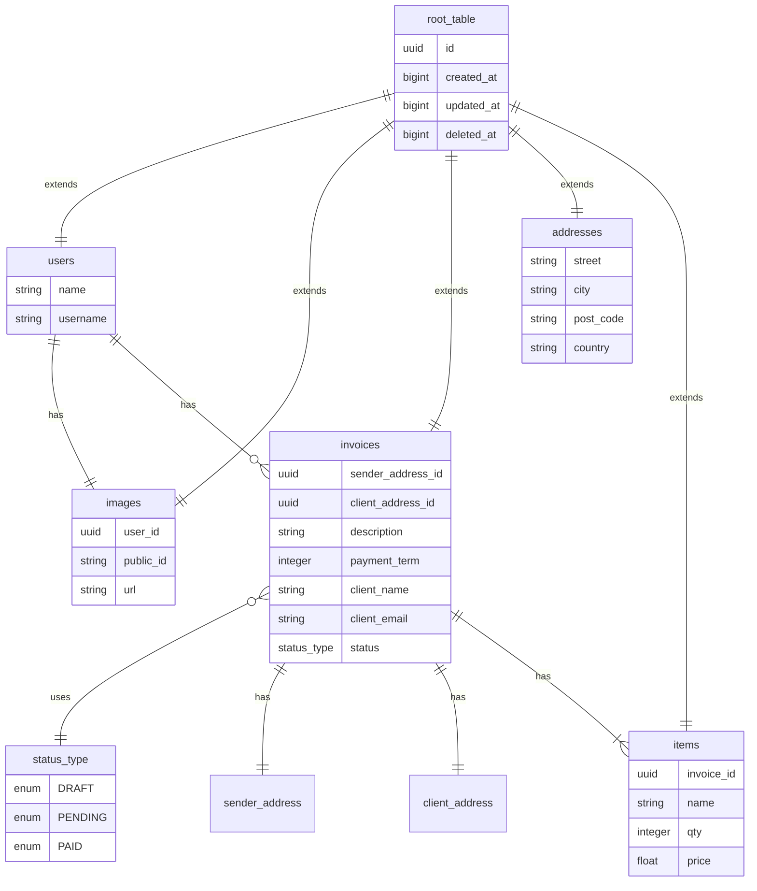

# ASP INVOICES 💰

## 📌 About This Project

Full-Stack **Invoices** application created as learning project.
The UI and layout are built following the official design from [Frontend Mentor](https://www.frontendmentor.io/).

**Live** version available on [Fly.io](https://asp-invoices-client.fly.dev/).

---

## 🧱 Tech Stack

The name **ASP** comes from the core stack that powers the project:

- **A** => **Angular** for building the client interface
- **S** => **Spring Boot** for the backend logic and API layer
- **P** => **PostgreSQL** for handling data persistence and storage

Together they form a clean, modern **full-stack architecture** 🚀

---

### 🖥️ **Client**

- **Angular 20** — Zoneless frontend framework with SSR support and Signals for fine-grained reactivity
- **TypeScript** — A typed superset of JavaScript for safer, maintainable code
- **RxJS** — Reactive programming library for handling asynchronous data streams
- **NgRx (Store + Effects)** — Predictable global state management and side-effect handling built on **RxJS**
- **Angular Forms + Zod** — Reactive form handling with schema-based, type-safe validation
- **Angular HTTPClient** — Built-in HTTP module with interceptors for secure API integration
- **Tailwind CSS** + **Sass** — Utility-first CSS with extended support for custom and complex designs
- **Motionone** — Modern animation library for the DOM with concise syntax similar to **Framer Motion** (React)
- **svg_ng_cli** — Custom **Python** CLI tool that parses SVG files into Angular components with dynamic color and size bindings

---

### 💾 **Server**

- **Java 21** — Primary backend language
- **Spring Boot (WebFlux)** — Reactive, non-blocking backend framework powered by an **event-loop** execution model
- **Project Reactor** — Core reactive foundation powering **WebFlux** and **Redis** for fully non-blocking data flows
- **Redis (Lettuce)** — Async/reactive Redis client for caching and real-time data
- **PostgreSQL + R2DBC** — Asynchronous database access with reactive drivers
- **Liquibase** — Database migrations, written in raw SQL for full control
- **Cloudinary (Reactive WebClient)** — Manually integrated using Spring’s WebClient, enabling fully non-blocking image and video uploads
- **java_pkg_cli** — Custom **Python** CLI utility to automatically add dependencies to both the **TOML catalog** and **Gradle build file**, eliminating repetitive hardcoding and improving consistency in dependency management

---

### 🛠️ **DevOps & Deployment**

- **Turborepo** — Monorepo project structure for managing client and server together, with coordinated scripts and parallel builds
- **Docker** — Ensures consistent environments for development and production across both client and server
- **Docker Hub** — Publishing and managing images
- **Kind** — Run local Kubernetes clusters for development
- **GitHub Actions** — Automated pipelines for testing, building, and deploying both apps
- **Fly.io** — Hosting platform (client and server deployed as separate services)
- **Upstash** — Hosting platform for Redis
- **Zsh** — Custom shell scripts for scaffolding and developer productivity
- **sync_env_cli** — Custom **Python** CLI tool that synchronizes environment variables across the client and server directories, updates **Kubernetes** secrets, and patches environment variables in the Git-based **CI/CD pipeline** for deployment.

---

## 📦 Setup

After cloning the repository, start by installing the dependencies:

```bash
yarn install && yarn install_pkg
```

This will initialize the project and install all required packages for both client and server.

---

### 🔒 Environment Variables

All required environment variables are listed in:

[`apps/server/app/src/main/resources/application.yml`](apps/server/app/src/main/resources/application.yml)

This file not only configures the server but also declares the environment variables required by the application.

- **Main runtime** variables are grouped under the top-level key **app**.

- **Database** variables are grouped under the key **spring.r2dbc** and them will be generated automatically on boot from the **app** ones.

- **💡Note**:
  The same variables must also be present in a **kind-secrets.yml** file (not committed to git). This file is required if you want to run the app in a local **Kubernetes cluster** via **Kind**.
  A template for this file looks like:

  ```bash
  apiVersion: v1
  kind: Secret
  metadata:
  name: asp-invoices
  type: Opaque
  stringData:
  APP_NAME: "asp-invoices"
  ...rest key value pairs variables
  ```

---

### 📜 Scripts

To streamline development, I created a set of helper scripts located in the [**scripts**](scripts) folder.  
They are written in **Zsh**, so you can either copy them into your **.zshrc** file or place them wherever you normally keep custom scripts.

---

### 🛠️ Build & Run

To start a development session, run:

```bash
yarn dev
```

This command uses **Turborepo** to run both the **Java server** and the **Angular client** in parallel:

- ☕ **Java** runs at [http://localhost:3000](http://localhost:3000)
- 🟦 **Angular** runs at [http://localhost:3001](http://localhost:3001)

---

To build the app, run:

```bash
yarn build
```

This triggers **Turborepo** to build both the client and server in parallel:

- ☕ **Java** Compiles to bytecode and produces a `.jar` file at [apps/server/app/build/libs/server-1.0.0.jar](apps/server/app/build/libs/server-1.0.0.jar)
- 🟦 **Angular** Runs the Angular build pipeline and generates output according to the rendering configuration defined in [apps/client/src/app/app.routes.server.ts](apps/client/src/app/app.routes.server.ts)

---

Once the build is complete, you can start servers with:

```bash
yarn start
```

This again uses **Turborepo** to launch both the **Java server** and the **Next.js client** in parallel:

- ☕ **Java** runs at [http://localhost:3000](http://localhost:3000)
- 🟦 **Angular** is served at [http://localhost:3001](http://localhost:3001)

---

### 🐋 Docker

#### 🛠️ Build

To build the **client** Docker image, run:

```bash
dbc
```

---

To build the **server** Docker image, run:

```bash
dbs
```

---

#### 🐳 Start

To start a container:

- **Server**

```bash
dsi 0
```

- **Client**

```bash
dsi 1
```

---

#### 🔗 Result

- 🟦 **Angular** is packaged into a Docker image and served from a container at [http://localhost:3001](http://localhost:3001)
- ☕ **Java** compile to bytecode and the generated **.jar** file is run inside a container at [http://localhost:3000/api/v1](http://localhost:3000/api/v1)

---

### 🔀 Nginx Reverse Proxy

To mirror the production setup, I use an **Nginx reverse proxy** that listens on port **443 (HTTPS)** and routes requests to the correct service:

- In **development**:

  - ☕ Server => port **3000**
  - 🟦 Client => port **3001**

- In **Kubernetes**:
  - ☕ Server => port **30080**
  - 🟦 Client => port **30081**

This setup provides a **single HTTPS entrypoint** while internally forwarding traffic to the right service.  
It also avoids the need for a separate `kind` mode (like `ENV_M0DE=kind`) — Nginx handles all routing automatically.

Configuration files can be found at [nginx](nginx)

---

#### 🔄 Switching Between Environments

Instead of hardcoding routes, the last line **include /etc/nginx/env/active.conf** in the [nginx/nginx.conf](nginx/nginx.conf) file acts as an entrypoint for environment-specific configs.

The script [`ngx`](scripts/nginx/ngx) in **scripts/nginx** manages a **symlink** (active.conf) that points to the right environment file:

- **Development** => /etc/nginx/env/dev.conf
- **Kubernetes** => /etc/nginx/env/kind.conf

---

##### 🛠️ Development config

Running

```bash
ngx
```

Activates dev.conf

---

##### 🐳 Kind config

Running

```bash
ngx k
```

Activates kind.conf

---

### 🚢 Kubernetes

To start a local **Kubernetes Cluster** run

```bash
kcc
```

The script present in [scripts/kind.zsh](scripts/kind.zsh) will

- **Create the cluster** using **Kind** passing the config file at repo root
- **Apply secrets** defined in **kind-secrets.yml**
- **Deploy the applications** using the manifests located in:

  - [`apps/client/kind-deploy.yml`](apps/client/kind-deploy.yml)
  - [`apps/client/kind-service.yml`](apps/client/kind-service.yml)
  - [`apps/server/kind-deploy.yml`](apps/server/kind-deploy.yml)
  - [`apps/server/kind-service.yml`](apps/server/kind-service.yml)

#### 🔗 Access

- **Client** => available at **[http://localhost:30081](http://localhost:30081)**
- **Server** => available at **[http://localhost:30080](http://localhost:30080)**

If you’ve set up the **Nginx reverse proxy** (see section above), it will automatically route these internal ports behind a single HTTPS entrypoint (port 443).

---

## 🐘 PostgreSQL Tables



---

## 🛠️ CI/CD

The pipeline is defined in [`GitHub Workflows`](.github/workflows/check_deploy.yml) and runs automatically on every push to the **main** branch.

## ✏️ Final Notes

I hope you find the project interesting — if not, the app doesn’t come with a refund policy 💰

Thanks for checking out the repo ✌🏼
